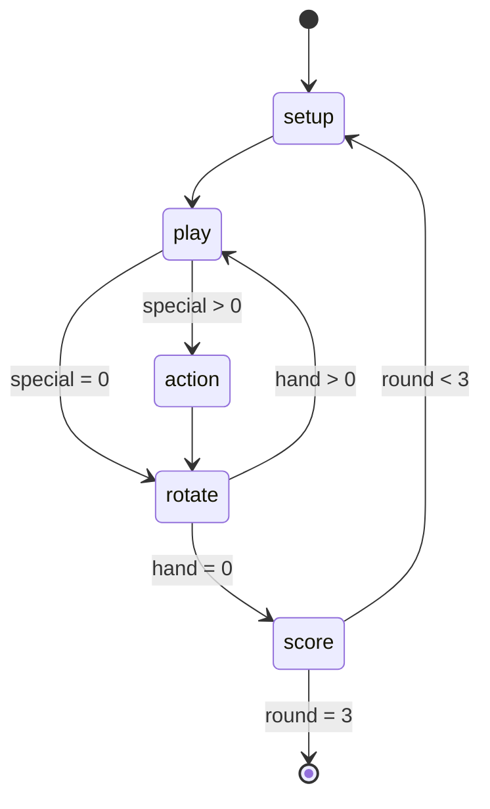

# sushi-go-game

Game state:

Card interactions:

- during play

  - special order: choose to copy from cards played before this turn
    - if special action, add to special queue (cannot select special action)
  - chopsticks: if as bonus action, add to special queue
  - spoon: if as bonus action, add to special queue
  - menu: add to special queue
  - takeout box: add to special queue
  - other cards: add to tray

- during special action

  - chopsticks
    1. choose to play from own hand
       - if special order, copy
       - if special action, add to special queue
    2. move to own hand
  - spoon
    1. choose to play by name and obtain from other's hand if match
       - if special order, copy
       - if special action, add to special queue
    2. move to other's hand
       - if no match, discard
  - menu
    1. choose to play from menu hand
       - if special order, copy
       - if special action (non-menu), add to special queue
    2. move to discard
  - takeout box
    1. choose to flip (can be more than one) from cards played before this turn
    2. move to discard

- during card rotate

  - uramaki: if criteria met, discard
  - miso soup: if criteria met, discard

- during score

  - wasabi: if criteria met, multiply nigiri score

Card states:

- normal (in hand, menu hand, or tray)
- discarded
  - if special order failed, discard
  - after special card actions are completed, discard
  - after criteria met for uramaki and miso soup, discard
- copied
  - after special order is changed, revert when returning to deck or discard
- flipped
  - after cards are flipped, revert when returning to deck or discard
- copied and flipped: both copy and flip revert to special order on discard
  - flipped a copied card => `t: [flipped], c: [i, 'table'], f: [i, 'fake']`
  - copied a flipped card => `t: [flipped], c: [i, 'table'], f: []`
